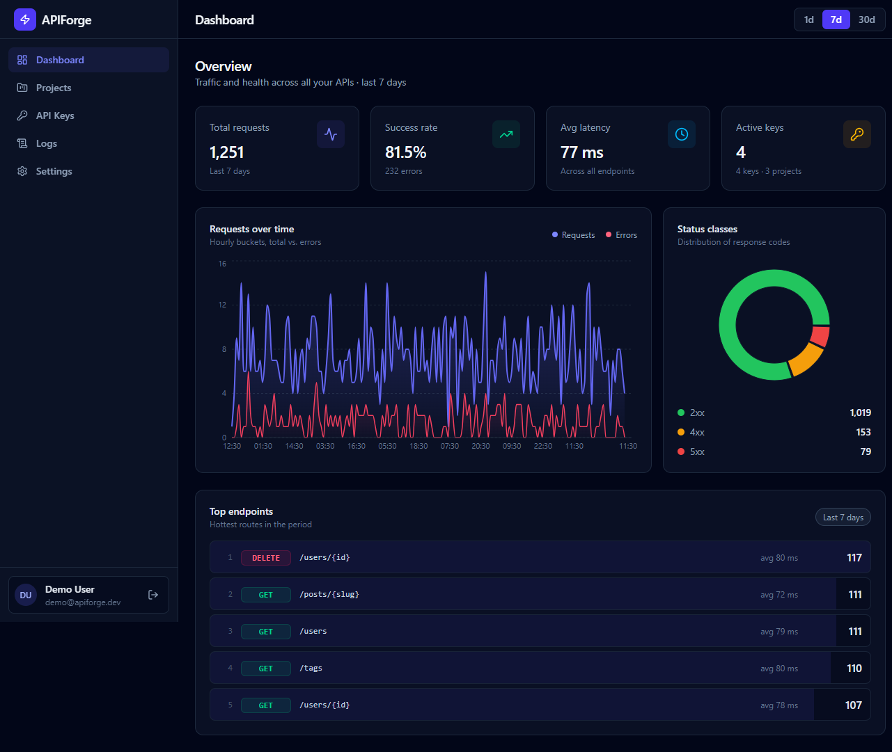
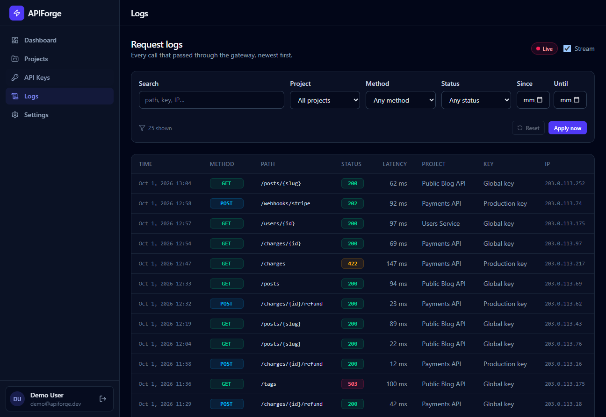
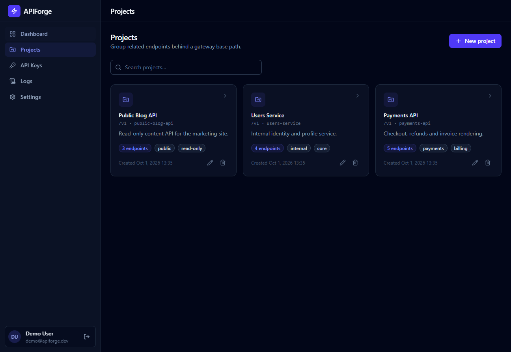
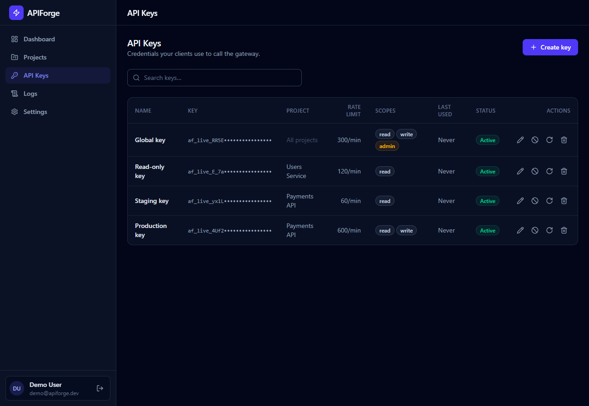

# APIForge

<div dir="rtl">

**پلتفرم مدیریت API** — تعریف API، صدور کلید دسترسی، اعمال rate limit، شبیه‌سازی یا پروکسی ترافیک، و مشاهده‌ی زنده‌ی هر درخواست.

ساخته‌شده به‌عنوان پروژه‌ی رزومه، برای نمایش مهارت‌های مهندسی فول‌استک:
بک‌اند **Django 6 + DRF** با وب‌سوکت **Django Channels**، فرانت‌اند **React 19 + TypeScript**، **PostgreSQL**، **Redis**، داکر و CI.

[English version](README.md) · [راهنمای دیپلوی Liara](docs/deployment-fa.md)

---

## تصاویر

| داشبورد | لاگ زنده |
|---|---|
|  |  |

| پروژه‌ها | کلیدهای API |
|---|---|
|  |  |

---

## فهرست

- [چه چیزی ساخته شده](#چه-چیزی-ساخته-شده)
- [معماری](#معماری)
- [تکنولوژی‌ها](#تکنولوژیها)
- [اجرای محلی](#اجرای-محلی)
- [استفاده از Gateway](#استفاده-از-gateway)
- [مستندات API](#مستندات-api)
- [تست‌ها](#تستها)
- [دیپلوی](#دیپلوی)
- [ساختار پروژه](#ساختار-پروژه)
- [تصمیم‌های مهندسی](#تصمیمهای-مهندسی)

---

## چه چیزی ساخته شده

| قابلیت | کجاست |
|---|---|
| احراز هویت JWT با چرخش (rotation) توکن refresh | `apps/accounts` |
| CRUD پروژه‌ها و اندپوینت‌ها با جداسازی کامل کاربران | `apps/apis` |
| کلید API: هش‌شده با SHA-256، نمایش یک‌باره، rotate/revoke | `apps/keys` |
| **Gateway**: احراز هویت با کلید، rate limit، mock **یا** پروکسی، ثبت لاگ | `apps/gateway` |
| تحلیل داده: خلاصه، نمودار زمانی، توزیع وضعیت، پرترافیک‌ترین مسیرها | `apps/analytics/services.py` |
| **استریم زنده‌ی لاگ درخواست‌ها با WebSocket** | `apps/analytics/consumers.py` |
| صفحه‌ی لاگ با cursor pagination، جستجو و فیلتر | `apps/analytics/views.py` |
| اسکیمای OpenAPI 3 + Swagger UI + ReDoc (بدون هیچ warning) | `/api/schema/` |
| ۹۹ تست (احراز هویت، جداسازی tenant، gateway، تحلیل داده، realtime، SPA) | `backend/tests/` |
| CI: ruff، بررسی Django، تست روی SQLite **و** PostgreSQL، بیلد فرانت، بیلد داکر | `.github/workflows/ci.yml` |
| دیپلوی خودکار روی Liara با گیت‌هاب اکشنز | `.github/workflows/deploy-liara.yml` |

---

## معماری

```
                  ┌──────── React SPA (Vite) ────────┐        (توسعه)
                  │  داشبورد · پروژه‌ها · کلیدها · لاگ‌ها │
                  └───────────────┬──────────────────┘
                        HTTPS/JSON │ JWT                    WS  │ ?token=<jwt>
                  ┌───────────────▼─────────────────────────────▼──────────────┐
   کنترل‌پلن      │  daphne (ASGI)                                            │
                  │    ├── /api/*        DRF ویو‌ست‌ها (JWT)                   │
                  │    ├── /api/schema/  drf-spectacular                      │
   دیتاپلن        │    ├── /ws/logs/     کانسیومر Channels (لاگ زنده)           │
                  │    ├── /gateway/*    گیت‌وی با کلید API (mock | proxy)       │
   (یک پورت)      │    └── /*            پوسته‌ی React و فایل‌های هش‌شده           │
                  └───┬────────────────────────────────────┬──────────────────┘
                          │                                    │
                 ┌────────▼────────┐                  ┌────────▼────────┐
                 │  PostgreSQL 16  │                  │  Redis 7         │
                 │  منبع اصلی     │                  │  rate limit      │
                 │  داده           │                  │  channel layer   │
                 └─────────────────┘                  └──────────────────┘
```

**کنترل‌پلن** (`/api/*`) — API مدیریت، محافظت‌شده با JWT.
**دیتاپلن** (`/gateway/*`) — پلن عمومی ترافیک، احراز هویت با **کلید API** (نه JWT)، دارای rate limit به‌ازای هر کلید، و ثبت هر درخواست.

در حالت توسعه، فرانت را Vite سرو می‌کند و Django روی پورت ۸۰۰۰ اجرا می‌شود.
در کانتینر، هر دو در **یک ایمیج** قرار می‌گیرند: Django پوسته‌ی React را از طریق WhiteNoise سرو می‌کند،
پس **یک پروسه‌ی ASGI روی یک پورت** به `/api`، `/ws`، `/gateway` و کل SPA پاسخ می‌دهد — دقیقاً همان چیزی که
Paasهایی مثل Liara انتظار دارند.

---

## تکنولوژی‌ها

**بک‌اند** — Django 6.1 · DRF 3.18 · Django Channels 4.3 · drf-spectacular · django-filter ·
simplejwt · psycopg 3 · httpx · daphne · pytest · ruff

**فرانت‌اند** — React 19 · TypeScript (strict) · Vite 7 · TanStack Query 5 · zustand 5 ·
axios · Recharts 3 · Tailwind CSS 4 · lucide-react

**زیرساخت** — PostgreSQL 16 · Redis 7 · داکر چندمرحله‌ای · GitHub Actions · Liara (ایران)

---

## اجرای محلی

نیازمندی: **پایتون ۳.۱۲+** و **نود ۲۰+**

### گام ۱ — بک‌اند

```bash
cd backend
python -m venv .venv

# لینوکس / مک
.venv/bin/pip install -r requirements-dev.txt

# ویندوز (PowerShell)
.venv\Scripts\pip install -r requirements-dev.txt

.venv/bin/python manage.py migrate
.venv/bin/python manage.py seed_demo      # داده‌ی نمونه + چاپ کلیدهای ساخته‌شده
.venv/bin/python manage.py runserver 8000
```

> **نکته‌ی شبکه در ایران:** اگر `pip install` با خطای
> `Failed to resolve IP address for 'files.pythonhosted.org'` شکست خورد،
> شبکه‌ی شما CDN پایپی را بلاک می‌کند. فقط برای همین نصب، آینه را به pip بدهید:
> ```powershell
> $env:PIP_INDEX_URL='https://pypi.tuna.tsinghua.edu.cn/simple'
> pip install -r requirements-dev.txt
> ```
> چیزی در مخزن نیاز به تغییر ندارد.

### گام ۲ — فرانت‌اند (ترمینال دوم)

```bash
cd frontend
npm install
npm run dev        # http://localhost:5173
```

Vite درخواست‌های `/api`، `/gateway` و `/ws` را به پورت ۸۰۰۰ پروکسی می‌کند.

### ورود

| | |
|---|---|
| نشانی | <http://localhost:5173> |
| ایمیل | `demo@apiforge.dev` |
| رمز | `DemoPass!234` |

مستندات Swagger: <http://localhost:8000/api/docs/>

> **دیتابیس لازم نیست:** اگر PostgreSQL نصب نباشد، بک‌اند خودکار روی SQLite
> (`backend/db.sqlite3`) اجرا می‌شود — بدون هیچ پیکربندی.

### اجرا با داکر (کل پشته)

```bash
cp .env.example .env      # ویندوز: copy .env.example .env
docker compose up --build
```

| سرویس | نشانی |
|---|---|
| SPA + API (روی یک پورت) | <http://localhost:8000> |
| Swagger UI | <http://localhost:8000/api/docs/> |
| پنل ادمین | <http://localhost:8000/admin/> |
| بررسی سلامت | <http://localhost:8000/api/health/> |

```bash
docker compose exec app python manage.py seed_demo   # داده‌ی نمونه
```

---

## متغیرهای محیطی

همه‌چیز از طریق متغیر محیطی کنترل می‌شود (`backend/config/settings/`)، پس یک ایمیج
هم روی لپ‌تاپ و هم روی سرور production اجرا می‌شود.

| متغیر | پیش‌فرض | کاربرد |
|---|---|---|
| `DJANGO_SECRET_KEY` | *(مقدار توسعه)* | **در production اجباری است** |
| `DJANGO_SETTINGS_MODULE` | `config.settings.dev` | `dev` / `production` / `test` |
| `DJANGO_ALLOWED_HOSTS` | `localhost,127.0.0.1` | جدا شده با کاما |
| `DATABASE_URL` | – | هر URL که `dj-database-url` بفهمد |
| `POSTGRES_HOST/PORT/DB/USER/PASSWORD` | – | وقتی `DATABASE_URL` خالی است |
| `REDIS_URL` | – | rate limit مشترک + وب‌سوکت بین workerها |
| `CORS_ALLOWED_ORIGINS` | `http://localhost:5173` | جدا شده با کاما |
| `GATEWAY_BASE_URL` | `http://localhost:8000` | برای ساخت فیلد `gateway_url` |
| `ALLOW_PRIVATE_UPSTREAM` | `true` در DEBUG | محافظت در برابر SSRF |
| `SERVE_SPA` | خودکار | سرو کردن بیلد React توسط Django |
| `SEED_DEMO` | `false` | ساخت داده‌ی نمونه هنگام بالا آمدن کانتینر |

ترتیب تصمیم‌گیری تنظیمات ساده و صریح است:

```
DATABASE_URL هست؟     ──►  Postgres (یا هر چه URL بگوید)
POSTGRES_HOST هست؟    ──►  PostgreSQL
وگرنه                 ──►  SQLite

REDIS_URL هست؟         ──►  کانال‌لییر و کش Redis
وگرنه                 ──►  کانال‌لییر درون‌حافظه‌ای و کش محلی
```

---

## استفاده از Gateway

۱. یک پروژه و یک اندپوینت بسازید (حالت mock برای شروع کافی است).
۲. یک کلید API صادر کنید — متن اصلی **فقط یک‌بار** برگردانده می‌شود.
۳. درخواست بزنید:

```bash
curl -H "X-API-Key: af_live_..." \
     http://localhost:8000/gateway/payments-api/charges
```

```json
{ "data": [], "has_more": false }
```

پاسخ‌های موفق، هدرهای اطلاعاتی گیت‌وی را حمل می‌کنند:

| هدر | معنی |
|---|---|
| `X-Request-Id` | شناسه‌ی ردیف `RequestLog` ذخیره‌شده |
| `X-Gateway-Latency-Ms` | زمان پردازش سمت سرور |
| `X-RateLimit-Limit` / `X-RateLimit-Remaining` | سهمیه‌ی کلید فراخوان |

خطاها قابل‌پردازش ماشینی‌اند:

```json
{ "error": { "code": "rate_limited", "message": "Rate limit of 5 requests/minute exceeded." } }
```

| کد | وضعیت |
|---|---|
| `api_key_required`، `invalid_api_key` | ۴۰۱ |
| `key_revoked`، `key_expired`، `key_scope_mismatch` | ۴۰۳ |
| `project_not_found`، `endpoint_not_found` | ۴۰۴ |
| `rate_limited` | ۴۲۹ (به‌همراه `Retry-After`) |
| `upstream_error` | ۵۰۲ |
| `no_backend_configured` | ۵۰۱ |

برای پروکسی، کافی است `target_url` اندپوینت را تنظیم کنید؛ گیت‌وی متد، کوئری،
body و هدرها را با `httpx` به سرویس مقصد می‌فرستد و پاسخ را برمی‌گرداند.
مقصدهای loopback یا شبکه‌ی خصوصی رد می‌شوند (مگر `ALLOW_PRIVATE_UPSTREAM` روشن باشد).

---

## مستندات API

- اسکیمای OpenAPI 3: <http://localhost:8000/api/schema/>
- Swagger UI: <http://localhost:8000/api/docs/>
- ReDoc: <http://localhost:8000/api/redoc/>
- قرارداد کامل بین فرانت و بک‌اند: [`docs/api-contract.md`](docs/api-contract.md)

<details>
<summary>خلاصه‌ی مسیرها</summary>

**احراز هویت** `/api/auth/`
`POST register/` · `POST token/` · `POST token/refresh/` · `POST token/verify/` · `GET|PATCH me/`

**پروژه‌ها** `/api/projects/`
فهرست/ساخت · جزئیات/ویرایش/حذف · فیلترها: `search`، `tag`، `is_public`، `ordering`

**اندپوینت‌ها** `/api/endpoints/`
فهرست/ساخت · جزئیات/ویرایش/حذف · فیلترها: `project`، `method`، `is_active`، `search`

**کلیدهای API** `/api/keys/`
فهرست/ساخت · جزئیات/ویرایش/حذف · `POST {id}/revoke/` · `POST {id}/rotate/` · `GET stats/`

**تحلیل داده** `/api/analytics/`
`GET summary/` · `GET timeseries/` · `GET status-distribution/` · `GET top-endpoints/`
(همه با `?project=&days=1|7|30`)

**لاگ‌ها** `/api/logs/`
`GET` با cursor pagination، فیلترها: `search`، `project`، `method`، `status_class`،
`min_status`، `max_status`، `since`، `until`

**وب‌سوکت** `ws://…/ws/logs/?token=<jwt>`
پیام سرور به کلاینت: `{"type": "log.created", "data": { …لاگ… }}`

</details>

---

## تست‌ها

```bash
cd backend
pytest                                  # ۹۹ تست روی SQLite درون‌حافظه‌ای
TEST_DB_ENGINE=postgres pytest          # همان تست‌ها روی PostgreSQL
ruff check . && ruff format --check .
```

نکات مهم پوشش تست:

- **جداسازی tenant** — کاربر دوم روی پروژه/کلید/لاگ/آمار کاربر اول `404` می‌گیرد، نه `403` با داده.
- **محرمانگی کلید** — متن اصلی هرگز ذخیره نمی‌شود؛ فقط هش SHA-256 در دیتابیس است.
- **مسیرهای خطای گیت‌وی** — کلید ناقص، نامعتبر، revoked، منقضی، ناسازگار با پروژه، rate limit، محافظ SSRF.
- **پایداری cursor** — صفحه‌ی دوم لاگ هیچ ردیف تکراری یا جاافتاده‌ای ندارد.
- **رگرسیون realtime** — هر مقدار در payload استریم باید JSON-serializable باشد (یک `UUID` خام قبلاً استریم زنده را بی‌صدا از کار انداخته بود).

---

## دیپلوی

<details>
<summary><b>گام‌به‌گام روی Liara</b> (ایران)</summary>

```bash
npm install -g @liara/cli
liara login
liara create apiforge --platform docker --port 8000

liara db create apiforge-db --plan g5
liara redis create apiforge-redis --plan g5
liara db env apiforge-db          # رشته‌ی اتصال

liara env set \
  DJANGO_SECRET_KEY="<کلید-تصادفی>" \
  DATABASE_URL="<اتصال-پستگرس>" \
  REDIS_URL="<آدرس-ردیس>" \
  SERVE_SPA=true

liara deploy --platform docker --port 8000 --app apiforge
```

راهنمای کامل، از جمله اتصال **دامنه‌ی `.ir`**، دیپلوی خودکار و عیب‌یابی:
**[`docs/deployment-fa.md`](docs/deployment-fa.md)**

</details>

---

## ساختار پروژه

```
apiforge/
├── Dockerfile                یک ایمیج: SPA با Node + بک‌اند Django
├── liara.json                پیکربندی استقرار روی Liara
├── docker/entrypoint.sh      انتظار برای DB، migrate، collectstatic، seed
├── docker-compose.yml        PostgreSQL + Redis + اپلیکیشن
├── backend/
│   ├── config/                 تنظیمات (base/dev/production/test)، urls، asgi، wsgi
│   ├── apps/
│   │   ├── common/             مدل‌های انتزاعی، صفحه‌بندی، خطاها، middleware وب‌سوکت، seeder
│   │   ├── accounts/           کاربر سفارشی، ثبت‌نام، JWT
│   │   ├── apis/               پروژه‌ها و اندپوینت‌ها
│   │   ├── keys/               کلیدهای API
│   │   ├── analytics/          لاگ درخواست‌ها، تجمیع داده، کانسیومر وب‌سوکت
│   │   └── gateway/            دیتاپلن عمومی
│   ├── tests/                  مجموعه تست pytest + factory‌ها
│   └── pyproject.toml          پیکربندی ruff و pytest
├── frontend/                   اپلیکیشن React (Vite)
├── docs/
│   ├── api-contract.md         قراردادی که دو نیمه بر سر آن توافق دارند
│   ├── deployment-fa.md        راهنمای دیپلوی Liara + دامنه‌ی .ir
│   └── screenshots/            تصاویر همین صفحه
└── .github/workflows/          ci.yml · deploy-liara.yml
```

---

## تصمیم‌های مهندسی

**کلیدهای API هش می‌شوند، ذخیره نمی‌شوند.** فقط هش SHA-256 از راز در دیتابیس
می‌ماند؛ پیدا کردن کلید با ۱۲ کاراکتر اول انجام می‌شود و اعتبارسنجی با
`hmac.compare_digest` (ثابت‌زمان). یعنی دامپ دیتابیس قابلیت بازپخش ندارد، ولی
رابط کاربری هنوز `af_live_ab12••••••••••••` را نشان می‌دهد.

**گیت‌وی به فراخواننده اعتماد نمی‌کند.** همه‌ی querysetها به `request.user` محدود
شده‌اند؛ پروژه‌ی غریبه `404` می‌گیرد نه `403`، پس پلن عمومی وجودِ پروژه‌های
دیگران را لو نمی‌دهد. توابع تجمیع داده هم `owner` را صریحاً می‌گیرند.

**rate limit روی کش است، نه دیتابیس.** شمارنده‌ی پنجره‌ی ثابت با کلید API در
کش (Redis در production) نگه داشته می‌شود؛ یعنی مسیر داغ فقط یک رفت‌وبرگشت دارد.
پنجره از `int(time / 60)` مشتق می‌شود، پس نه job پاک‌سازی داریم و نه نوشتن اضافه
روی مسیر درخواست.

**لاگ‌ها cursor pagination دارند.** هر لحظه ردیف جدید می‌آید؛ صفحه‌بندی عددی
موقع اسکرول کردن ردیف تکراری یا جاافتاده تولید می‌کند. `created_at` کلید مرتب‌سازی
پایدار و ایندکس‌شده است، پس cursorها پایدار می‌مانند.

**ساخت یک ایمیج، یک پورت، بدون reverse proxy.** پروکسی Vite فقط یک راحتی توسعه
است. در کانتینر، پوسته‌ی React را WhiteNoise سرو می‌کند و Django هر مسیر غیر-API
را با یک negative lookahead
(`^(?!api/|gateway/|ws/|admin/|static/|media/|__)`) به `index.html` می‌فرستد —
پس hard refresh روی هر مسیر کار می‌کند، ولی یک اشتباه تایپی زیر `/api/` همچنان
`404` به‌صورت JSON برمی‌گرداند، نه صفحه‌ی HTML.

**همه‌چیز از محیط تأمین می‌شود.** حالت `dev` روی SQLite با کانال‌لییر درون‌حافظه‌ای
و بدون هیچ وابستگی اجرا می‌شود؛ `production` کلید محرمانه می‌خواهد، هدرهای امن
می‌گذارد و خودش بیلد فرانت را سرو می‌کند.

---

## مجوز

MIT — فایل [LICENSE](LICENSE).
</div>
